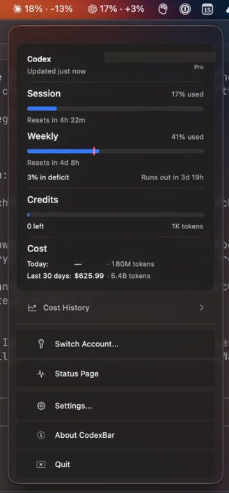

# CodexBar Lite

CodexBar Lite is a lightweight macOS menu bar app for watching Codex and Claude usage.

This repository is a fork of the original [steipete/CodexBar](https://github.com/steipete/CodexBar), and that
credit should be front and center: the core product idea, menu bar interface, and original CodexBar foundation
come from Peter Steinberger's upstream project.

<p align="center">
  
</p>

## Upstream Credit

- original project: [steipete/CodexBar](https://github.com/steipete/CodexBar)
- this fork: [bajman/codexbar-lite-menubar](https://github.com/bajman/codexbar-lite-menubar)

This fork keeps upstream attribution in the repository and in the app itself. See [NOTICE.md](NOTICE.md) and
[LICENSE](LICENSE) for licensing details.

## What This Fork Is

Upstream CodexBar is a broader menu bar tracker. This fork narrows the product down to a smaller, stricter,
lower-overhead variant:

- provider scope is reduced to `codex` and `claude`
- acquisition paths are intentionally simple
- WebView scraping and browser cookie import are avoided
- terminal UI scraping is avoided
- the app favors direct credential-backed fetches and local log analysis

The result is a more opinionated fork that tries to keep the UI benefits of CodexBar while cutting down on
fragile fallback machinery.

## What This Fork Changes On Top Of Upstream

The most important fork-specific changes are:

- a lighter fetch policy centered on direct `URLSession` requests and local log scanning
- Codex support via direct OAuth/API usage and credits fetches
- Claude support via a Claude-Code-compatible lightweight quota probe
- Claude `auto` mode that prefers the live Claude-Code-style probe and falls back to local logs only when live
  auth is unavailable
- conservative retry, cache, and backoff behavior so the app does not hammer provider endpoints
- local token-cost scanning for Codex and Claude JSONL logs
- menu bar glass, spacing, and layout refinements
- titled-window chrome normalization so the native macOS traffic lights and titlebar spacing behave correctly
- a bundled helper CLI for validation, scripting, and debugging

More recent hardening work in this fork includes:

- preventing stale Claude expiry metadata from being treated as a hard failure when the token still works
- replacing the old Claude usage endpoint path with the quota-header path Claude Code itself appears to use
- keeping Claude polling quiet with a success TTL, minimum probe intervals, and exponential backoff
- tearing down hidden menu content more aggressively to reduce unnecessary offscreen work
- precomputing chart input state to reduce render churn
- cleaning up panel spacing and Liquid Glass layering so the menu looks more balanced

## What The App Shows

CodexBar Lite is a glanceable menu bar surface for:

- Codex session usage
- Codex weekly usage
- Codex credits
- Codex and Claude local cost views
- Claude session usage
- Claude weekly usage
- provider status links
- recent refresh state and source information

It also includes:

- a bundled CLI helper at `CodexBar.app/Contents/Helpers/CodexBarCLI`
- provider settings in-app
- a menubar-focused Liquid Glass presentation

## Provider Behavior

### Codex

- credentials: `~/.codex/auth.json`
- live source: direct OAuth/API fetch
- credits: supported
- source modes: `auto` and `oauth` are effectively the same in lite mode

### Claude

- credentials: local Claude OAuth material from Keychain and Claude config data
- primary live source: a lightweight quota request that mirrors Claude Code behavior closely
- fallback source: local Claude logs when live auth is unavailable
- source modes:
  - `auto`: live quota probe first, local fallback only when needed
  - `oauth`: live quota probe only

## Lite Policy

This fork deliberately avoids the heavier acquisition paths that often become brittle:

Allowed:

- local credential reads
- direct network fetches using those credentials
- local log scanning for token-cost and fallback usage estimation

Avoided:

- embedded web dashboard scraping
- browser cookie scraping or decryption
- PTY automation or TUI scraping
- large fallback cascades across unrelated acquisition paths

## Build And Run

Normal development loop:

```bash
./Scripts/compile_and_run.sh
```

That script:

- kills running CodexBar instances
- packages the app bundle
- relaunches the app
- verifies that `CodexBar` stays running

Manual validation loop:

```bash
swift test
pnpm check
./Scripts/compile_and_run.sh
```

Package only:

```bash
./Scripts/package_app.sh
open CodexBar.app
```

## Helper CLI

The packaged app includes a CLI helper:

```text
CodexBar.app/Contents/Helpers/CodexBarCLI
```

Examples:

```bash
./CodexBar.app/Contents/Helpers/CodexBarCLI usage --provider codex --source oauth --format json --pretty
./CodexBar.app/Contents/Helpers/CodexBarCLI usage --provider claude --source auto --format json --pretty
./CodexBar.app/Contents/Helpers/CodexBarCLI cost --provider all --format json --pretty
```

## Repository Layout

- `Sources/CodexBar`: app UI, menu bar, windows, presentation
- `Sources/CodexBarCore`: providers, credential handling, fetchers, caching, local scanners
- `Sources/CodexBarCLI`: bundled helper CLI
- `Tests`: Swift Testing coverage
- `TestsLite`: lite-policy and robustness coverage
- `Scripts`: build, packaging, release, and validation helpers
- `docs`: provider notes, architecture docs, release docs, and fork audits

## Important Fork-Specific Files

- `Sources/CodexBarCore/Providers/Codex/`
- `Sources/CodexBarCore/Providers/Claude/`
- `Sources/CodexBarCore/Providers/LitePolicy.swift`
- `Sources/CodexBarCore/Vendored/CostUsage/`
- `Sources/CodexBar/LiquidGlassStyle.swift`
- `Sources/CodexBar/MenuPanelContentView.swift`
- `Sources/CodexBar/NativeWindowChrome.swift`

## Attribution And License

This is a downstream fork, not a clean-room reimplementation.

- original source and credit: [steipete/CodexBar](https://github.com/steipete/CodexBar)
- maintained fork: [bajman/codexbar-lite-menubar](https://github.com/bajman/codexbar-lite-menubar)

See [NOTICE.md](NOTICE.md) and [LICENSE](LICENSE).
